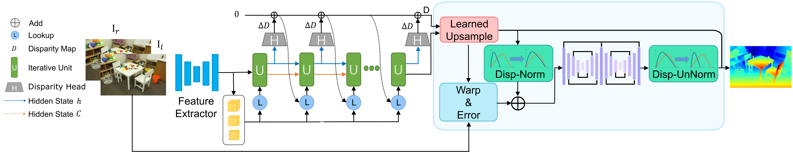

# High-frequency-Stereo-Matching-Network

<font color="#0000dd">High-Frequency Stereo Matching Network</font> [\[PDF\]](https://github.com/David-Zhao-1997/High-frequency-Stereo-Matching-Network/releases/download/v1.0.0/High-frequency.Stereo.Matching.Network.pdf)<br/>
CVPR 2023, Highlight<br/>
Haoliang Zhao, Huizhou Zhou, Yongjun Zhang, Jie Chen, Yitong Yang and Yong Zhao<br/>

```
@inproceedings{zhao2023high,
  title={High-Frequency Stereo Matching Network},
  author={Zhao, Haoliang and Zhou, Huizhou and Zhang, Yongjun and Chen, Jie and Yang, Yitong and Zhao, Yong},
  booktitle={Proceedings of the IEEE/CVF Conference on Computer Vision and Pattern Recognition},
  pages={1327--1336},
  year={2023}
}
```

## Software Requirements (Recommanded)
PyTorch 1.12.0 <br/>
CUDA 11.7



```Shell
pip install scipy
pip install tqdm
pip install tensorboard
pip install opt_einsum
pip install imageio
pip install opencv-python
pip install scikit-image
pip install einops
```
The program runs in a variety of environments, but the results may vary slightly.

## Required Data
To evaluate/train High-Frequency Stereo Matching Network, you will need to download the required datasets. 
* [Sceneflow](https://lmb.informatik.uni-freiburg.de/resources/datasets/SceneFlowDatasets.en.html#:~:text=on%20Academic%20Torrents-,FlyingThings3D,-Driving) 
* [Middlebury](https://vision.middlebury.edu/stereo/data/)
* [ETH3D](https://www.eth3d.net/datasets#low-res-two-view-test-data)
* [KITTI](http://www.cvlibs.net/datasets/kitti/eval_scene_flow.php?benchmark=stereo)

By default `stereo_datasets.py` will search for the datasets in these locations. You can create symbolic links to wherever the datasets were downloaded in the `datasets` folder

```Shell
├── datasets
    ├── FlyingThings3D
        ├── frames_cleanpass
        ├── frames_finalpass
        ├── disparity
    ├── Monkaa
        ├── frames_cleanpass
        ├── frames_finalpass
        ├── disparity
    ├── Driving
        ├── frames_cleanpass
        ├── frames_finalpass
        ├── disparity
    ├── KITTI
        ├── testing
        ├── training
        ├── devkit
    ├── Middlebury
        ├── MiddEval3
    ├── ETH3D
        ├── two_view_testing
```


## Build Sampler （Optional）
```Shell
cd sampler
rm -r build corr_sampler.egg-info dist
python setup.py install && cd ..
```

## Train
```Shell
bash ./train.sh
```

## Evaluate
Set the arguments in evaluate_stereo.py and execute
```Shell
python evaluate_stereo.py
```
